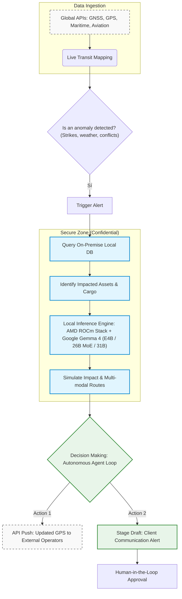

# LogiSecure


Agent-based and on-premise control hub for the automation, optimization, and real-time visibility of global logistics.

# 🚀 Quickstart (Backend)

**Option A — Docker (recommended, zero Python setup):**
```bash
docker compose -f deploy/docker-compose.yml up --build
```

**Option B — Local development (hot reload):**
```bash
# Windows (PowerShell)
.\scripts\setup.ps1

# Linux / macOS / Git Bash
./scripts/setup.sh

# then
cd backend
uvicorn main:app --reload   # activate backend/.venv first
```

Either way the API is served at:
| URL | Purpose |
|---|---|
| http://localhost:8000 | Service info |
| http://localhost:8000/docs | Interactive Swagger UI |
| http://localhost:8000/health | Liveness probe (used by Docker healthcheck) |
| http://localhost:8000/api/dashboard/sync?hq=roterdam | Master dashboard payload |

API keys are optional for a first boot — copy `.env.example` to `backend/.env` (the setup scripts do this) and fill keys in as you need real feeds. Working on the AI/agents layer? Additionally install `backend/requirements-ai.txt`.

# How it Works

## System Architecture & Data Pipeline

The system ingests and processes global supply chain and transportation APIs in real-time. Below is the end-to-end execution pipeline:

### 1. Global Supply Chain Monitoring
The system continuously ingests data from open-source and global APIs (GNSS/GPS, Baidu Maps, aviation, and maritime transponders) to map live transit routes.

### 2. Incident Detection
An external global anomaly is registered (e.g., a port strike, extreme weather/typhoons, or geopolitical conflicts). LogiSecure immediately triggers a system-wide alert.

### 3. Local Asset Correlation
The system cross-references the incident's geographic coordinates with the secure, on-premise database to identify exactly which confidential shipments, cargo manifests, and corporate assets are impacted.

### 4. Local AMD-Powered Inference
Using the AMD ROCm stack and local GPU/NPU hardware, an internal LLM analyzes the disruption data completely offline. It simulates operational impact, calculates alternative multi-modal routes, and projects financial metrics.

### 5. Agentic Autonomous Execution (vs. Fixed Workflows)
Unlike rigid, rules-based workflows (`if/else` pipelines), LogiSecure operates as an autonomous agentic loop. It dynamically evaluates non-linear variables to execute a proactive response plan:
* **Automated Dispatch:** Pushes optimized GPS coordinates to external transit operators via API.
* **Human-in-the-loop:** Generates a pre-drafted client communication alert, staged and ready for final engineer/operator approval.





## 🛠️ Technical Prerequisites & Architecture Setup

> ⚠️ **CRITICAL TEAM NOTE (PLEASE READ BEFORE CODING):** 
> To maximize development speed during this 5-day hackathon, **DO NOT attempt to configure full local ROCm kernel drivers on your workstations**. We will bypass local hardware barriers by routing our inference loop through cloud infrastructure (**AMD Developer Cloud / Fireworks AI Cloud Endpoints**). 
> 
> The hardware specifications below define our **Enterprise Production Target** (how the business sells to clients for 100% data sovereignty) and are kept here for architectural documentation and final judging presentation.

### 🌌 1. Hackathon Development Environment (What to use NOW)
To run the prototype on your local machine without crashes:
* **Backend Run Mode:** In your local `.env`, set `USE_AMD_ROCM=False`. This will route model inferences safely through the **Fireworks AI Cloud API** using our shared credits.
* **Frontend:** Standard React client running via Vite (`npm run dev`).
* **Docker Setup:** Use the cloud-proxy configurations to test data ingestion without freezing your laptop memory.

### 🏭 2. Enterprise On-Premise Production Target (For Final Client Deployment)
Once deployed on the logistics center's physical server rack, the infrastructure must satisfy the following bare-metal hardware and software stack:

#### Hardware Requirements
* **GPU/Accelerator:** AMD Instinct Series (MI200, MI300, or newer) or Radeon RX 7000/9000 Series (e.g., RX 7900 XTX) with dedicated VRAM for isolated enterprise LLM execution.
* **CPU:** x86_64 architecture (AVX2 instructions highly recommended).
* **Firmware:** Secure Boot must be disabled or configured with custom MOK keys to allow the AMD kernel-mode module to load safely.
* **BIOS Note:** Integrated Graphics (IGP) must be disabled in the BIOS to prevent runtime initialization conflicts with ROCm layers.

#### Host Operating System & Drivers
* **OS:** Ubuntu 24.04 LTS / 22.04 LTS or RHEL 9.x (Linux Kernel 5.15 or newer).
* **Kernel Driver:** Official AMD kernel-mode driver (`amdgpu-dkms`).
* **ROCm Stack:** ROCm v6.x / v7.x series (verify setup execution via `rocminfo`).

#### GPU Permissions Setup (Host Workstation Only)
By default, non-root system users cannot access raw GPU hardware compute layers. Run the following command on the target host deployment machine to add the operation user to the video and render systems:
```bash
sudo usermod -a -G video,render $USER
# Log out and log back in for kernel changes to take effect
```

### 4. Containerized Environment (Docker)
We leverage containerization via Docker to isolate dependencies. To expose the host's AMD compute layers inside the container, you must use the **AMD Container Runtime Toolkit** or map the device files explicitly.

#### Option A: Docker CLI Passthrough
```bash
docker run -it --network=host \
  --device=/dev/kfd \
  --device=/dev/dri \
  --security-opt seccomp=unconfined \
  rocm/rocm-terminal:latest
```

#### Option B: Docker Compose (Recommended for Devs)
Add the following device mapping block into your local `docker-compose.yml`:
```yaml
services:
  logisecure-agent:
    image: rocm/rocm-terminal:latest
    network_mode: "host"
    devices:
      - "/dev/kfd:/dev/kfd"
      - "/dev/dri:/dev/dri"
    security_opt:
      - "seccomp=unconfined"
    volumes:
      - ./:/workspace
```

### 5. AI Engine & Frameworks
* **PyTorch:** Must use the explicit ROCm-compiled wheel (not the standard CUDA/CPU variant).
* **Local Ingestion:** Ensure your outbound firewall allows traffic for open-source aviation/maritime transponder APIs on ports specified in the network configuration.

